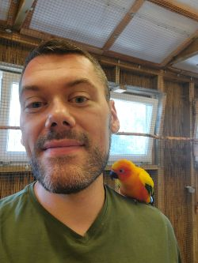

# 👋 Hi there, I'm Philip 
Welcome to my GitHub profile!
As I am still learning Python, there's not much to see right now, but there will be a lot of updates in the coming months.
Having a background in Marketing, my growing faszination with data work and new technologies lead to a shift in my career.
I am currently in a 1-year program to become a Python Backend Developer. 
Additionally I spend a lot of time to develop my skills in Data Analytics and Data Science.
My current goal is to deepen my knowledge in these areas and get my first projects going.

## 💪 Skills in Progress
- **Learning**: 
    - Python
    - Django
    - SQL
    - Pandas
    - Mathplotlib
- **Tools**:
    - VS Code
    - PyCharm
    - Docker
    - GitHub

## 🎯 Current Goals
1. Doing my first projects in backend development and Data Analysis
2. Building up my GitHub portfolio
3. Further develop my skills

## 🏆 Latest success
Making my Python Command Line Quiz available on [GitHub](https://github.com/JuliusDeane-data/Python_CL_Quiz)

## 📫 Contact me
- [GitHub](https://github.com/JuliusDeane-data)
- [LinkedIn](https://www.linkedin.com/in/philip-koloczek/)

## 🎉 Quote of the month
>"Only those who set out on a journey will discover new lands!" - Hugo von Hofmannsthal

## Thanks for visiting. Catch you soon! :)

